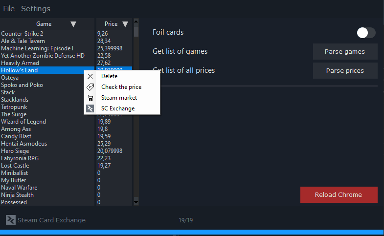
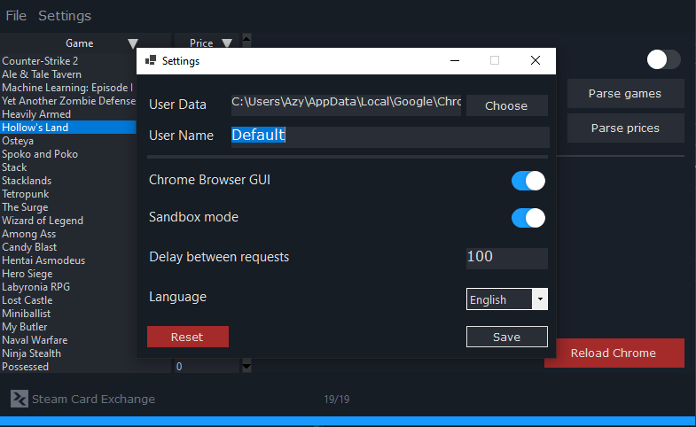

# Steam Badge Price Parser

A Windows application that helps analyze current Steam badge prices in your local currency through direct interaction with the Steam Marketplace.

## 🚀 Why is this needed?

The [SteamCardExchange](https://www.steamcardexchange.net/) service displays badge prices only in US dollars (USD), but the actual cost in other currencies (e.g., RUB, EUR, UAH) can vary significantly due to:
- Currency exchange rate fluctuations
- Steam regional pricing
- Market demand

**Example:** Two badges priced at $0.30 on SteamCardExchange may cost the following on the Steam Marketplace:
- 18 ₽ ($0.18)
- 38 ₽ ($0.38)

This application parses prices **directly through your Steam account**, taking into account your local currency for accurate calculations.

## 📸 Screenshots

|  |  |
|:--:|:--:|
| *Main Interface* | *Settings* |

## ✨ Features

- Automated parsing using Selenium and Chrome
- Requires Steam authorization for accurate price display
- Game filtering and sorting:
  - Select the number of games to display
  - Sort by badge cost
- Step-by-step parsing:
  1. Fetching the list of games from SteamCardExchange
  2. Sequential analysis of card prices via the Steam Community Market
- Processing speed: ~1 second per badge

## 🔒 Security

**Important:** The application **does not interact with your Steam account** beyond browser-based authorization. It does not have access to your personal data, inventory, wallet, or other account-specific information.  
- Authorization occurs through the standard Steam browser interface.
- The application does not save logins, passwords, or cookies.
- The entire parsing process occurs in the browser, and the program only processes publicly available data from the Steam Marketplace.
- For additional security, you can use a blank account with your desired currency set.
- All parser functions are located in the "Parser.cs" file.

## ⚙️ Installation and Requirements

1. **Requirements:**
   - Windows 7+
   - [.NET Framework 8.0](https://dotnet.microsoft.com/download/dotnet-framework) or newer
   - Google Chrome (latest version)
   - Installed [ChromeDriver](https://chromedriver.chromium.org/) (compatible with your Chrome version)

2. **Installation:**
   - Download the latest release from the [Releases](https://github.com/Azy-s/SteamBadgePrice-Parser/releases) section
   - Extract the archive
   - Ensure ChromeDriver is located in the application folder or added to PATH

## 🖥 Usage

1. Launch the application.
2. On first launch:
   - Log in to Steam via the opened Chrome window.
   - Navigate to the [badge prices page](https://www.steamcardexchange.net/index.php?badgeprices) and configure filters (number of games and sorting by price).
3. In the application:
   - Click **«Parse Games»** to load the list.
   - Select the desired games, then **Right-Click** and **[Check Price]**.
   - Alternatively, click **«Parse Prices»** to analyze the prices of all games in the list.

## ⚠️ Limitations

- Parsing depends on the speed of the Steam Community Market.
- A stable internet connection is required.
- Excessive requests may result in temporary access restrictions to the marketplace (this is not a ban).

## 📄 License

MIT License. For more details, see the [LICENSE](LICENSE) file.

---

**Important:** This is an unofficial tool. Use at your own risk. The developer is not affiliated with Valve or SteamCardExchange.
